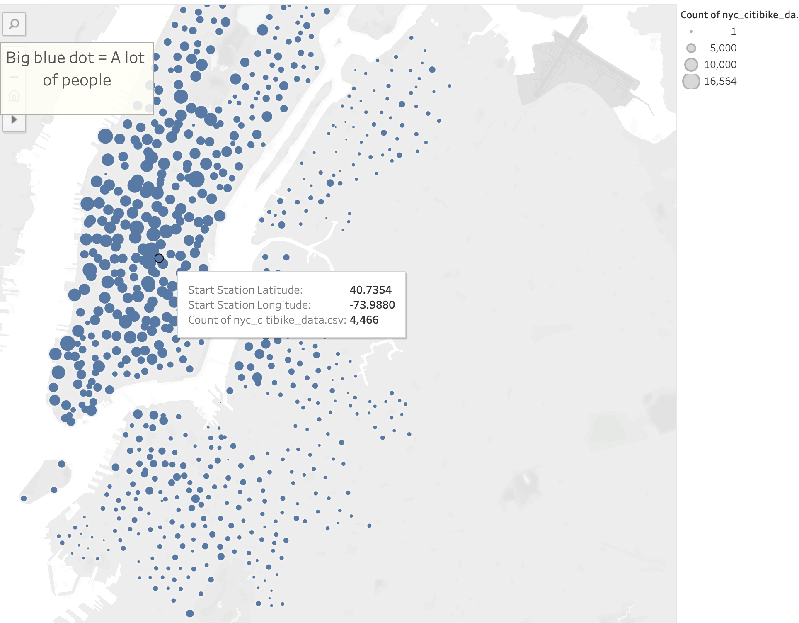
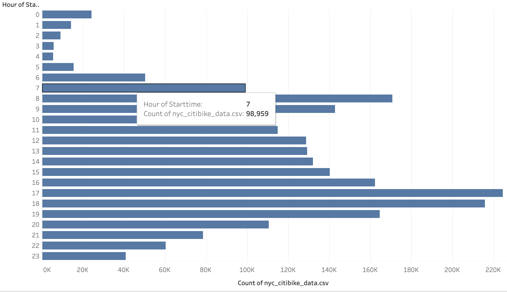

# Bikesharing

## Overview of the NYC Citibike Analysis

- The purpose of this analysis was creating a bike trip analysis from data collected from the Citi Bike program in New York City. With Citibike tripdata that was collected during the month of August 2019, tableau was utilized to modify the data and provide data visualizations of various data points to showcase to investors the market a bike-sharing program in Des Moines could possibly attract.

## Results

- Using Tableau, data modifications were made to the New York City Citibike data to bring you the data visualizations presented below:

**Top Starting Locations for NYC Citibikes**
    - Depicted below is a data visualization that tracks the starting latitude and longitude of various citibike stations for users. Using the citibike data to populate the map with blue bubbles, allow the audience to observe the most popular or most commonly used starting locations for citibike as the bigger the blue dot indicates the most used starting location. 

**Augst Peak Hours for NYC Citibikes**
    - Depicted below is a data visualization that used the NYC Citibike data for its columns to depict the tens of thousandands who use the citibike service throughout the day. The horizontal bars showcase the amount of users using citibike each hour of the day, and the audience can see that the times of 5pm to 7pm are the top riding hours for Citibike and 2AM to 5AM is when Citibike is rarely used.
 

