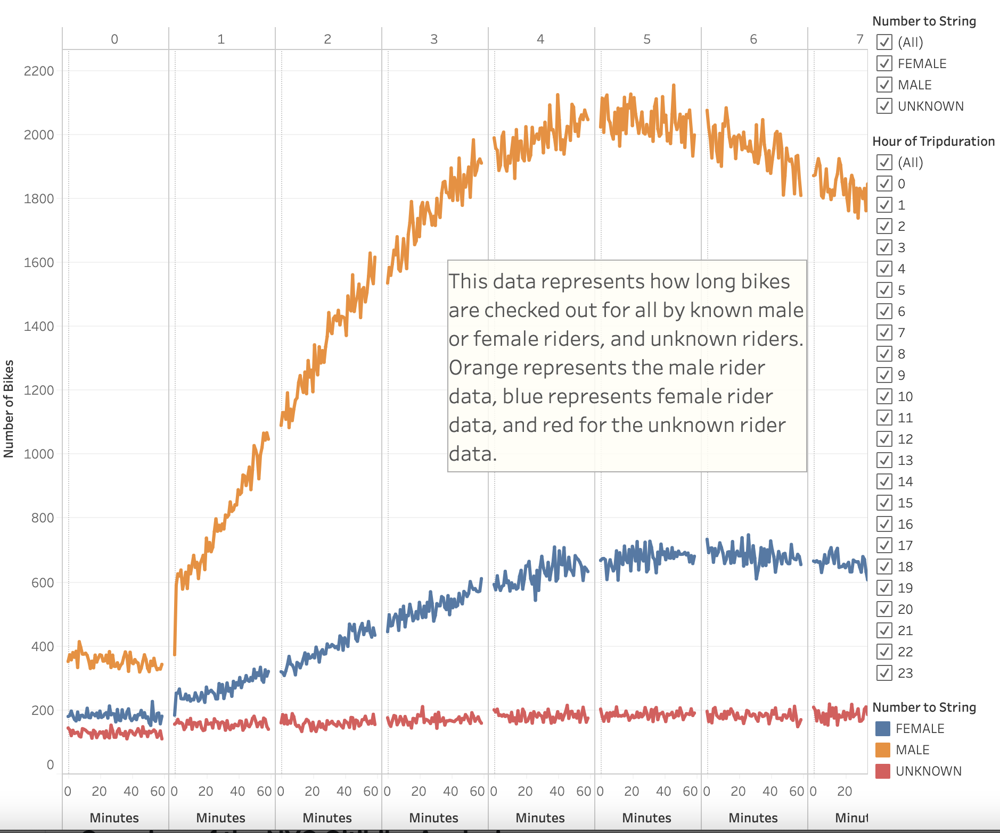

# Bikesharing

## Overview of the NYC Citibike Analysis

- The purpose of this analysis was creating a bike trip analysis from data collected from the Citi Bike program in New York City. With Citibike tripdata that was collected during the month of August 2019, tableau was utilized to modify the data and provide data visualizations of various data points to showcase to investors the market a bike-sharing program in Des Moines could possibly attract.

## Results

- Using Tableau, data modifications were made to the New York City Citibike data to bring you the data visualizations presented below:

**Top Starting Locations for NYC Citibikes**
    - Depicted below is a data visualization that tracks the starting latitude and longitude of various citibike stations for users. Using the citibike data to populate the map with blue bubbles, allow the audience to observe the most popular or most commonly used starting locations for citibike as the bigger the blue dot indicates the most used starting location. 

**Augst Peak Hours for NYC Citibikes**
    - Depicted below is a data visualization that used the NYC Citibike data for its columns to depict the tens of thousandands who use the citibike service throughout the day. The horizontal bars showcase the amount of users using citibike each hour of the day, and the audience can see that the times of 5pm to 7pm are the top riding hours for Citibike and 2AM to 5AM is when Citibike is rarely used.
 

**Trip Duration for NYC Citibike Users**
    - Depicted below is a data visualization that tracks the number of bikes used and how long they are used by the time of hour and amount of minutes they are used. The trip duration data visualization tracks at what time of hour users rode their bikes from, and how many minutes they rode their bikes. The discrete line graph showcases that during the hour of 5 or 6, users of citibike rode the longest during these hours. A filter of the hour of tripduration was added to provide customization.

**Trip Duration for NYC Citibike Users based on Gender**
    - Depicted below is a data visualization that tracks the number of bikes used and how long they are used by the time of hour and amount of minutes they are used based on noted gender or unknown users. The trip duration data visualization tracks at what time of hour males, females, or unknown riders rode their bikes, and how many minutes they rode their bikes. The discrete line graph showcases that males rode much longer on Citibike and that the hours of 5 and 6 were again prime riding hours for male and females. The Unknown riders had a flat constant discrete line. A filter of the hour of tripduration and gender and unknown riders was added to provide customization.

**Trips by all Riders (Weekday per Hour)**
    - Depcited below is a data visualization that uses a heat map to capture how many riders use the Citibike service during each weekday and at what time of day. The heat map visualization allows the audience to see the busiest usage time of Citibike during which weekday and at what time by how the darker gold color represents a lot of users and the lighter orange represents smaller number of users.

**Trips by Gender (Weekday per Hour)**
    - Depcited below is a data visualization that uses a heat map to capture how many female, male, and unknown riders use the Citibike service during each weekday and at what time of day. The heat map visualization allows the audience to see the busiest usage time of Citibike during which weekday and at what time by how the darker gold color represents a lot of users and the lighter orange represents smaller number of users. A filter of "Number to String" is available to edit between all, female, male, or unknown users of the citibike app. It is called "Number to string" as the original "Gender" column was converted from using "0 to 1" indicators to "Unknown, female, or male". 

**Trips by Usertype**
    - Depicted below is a heat map to capture how many female, male, and unknonw riders use the Citibike service based on the type of user they are, either a customer or subscriber. Also captured is the weekday in which the users ride a Citibike. The heat map visualization allows the audience to see the busiest time of week the bikes are used and are seperated appropriately to showcase the types of user of the service. The customer usertype are short-time users of the service of Citibike, whereas the subscriber usertype are those that are annually subscribed to the Citibike service. As mentioned before, the darker the color of blue the more users are recorded using the service, and the lighter the blue represents lighter usage of the Citibike service. A filter of "Number to String" and "Usertype" are available to edit between male, female, or unknown and also usertype.

## Summary
- From our results and the many data visualizations provided, a representation of the impact Citibike has had in New York City is a much needed sample size for future ventures of Citibike in cities such as Des Moines. The data collected and analyzed came from the month of August in New York City, and this showcased a unique insight into the busiest hours of Citibike usage and the top starting locations for the Citibike stations. From those two data points alone, the audience and investors can see that Citibike was heavilty used in the afternoon from 2PM to 7Pm and even maintained a steady flow of usage during the morning hours of 8AM to 12PM as people commuted for work or early morning activiies. Additionally, top starting stations based on bubble indications allowed for a visualization of potential or ideal spots for Citibike stations to be placed. Based on the "Top Starting Locatons", the urban-city seemed more likely to have more users of the service rather than the suburbs. The discrete line graphs provided valuable information of the demographics using Citibike. The data visualizations that provided what day of week, hour of day, and how long riders used the Citibike service is important data facts that determine the popularity and viability of Citibike as a service. The filters for gender and usertype also are huge important in figuring out demographics and usability. Gaining insight into our customers and how they interact with the Citibike is incremental in determining the success of Citibike in future establishments across various states. 
- Potential data visualizations that could further provide necessary feedback to audiences and investors alike inlcude
        
        1. A data visualization that takes into account price range or fees charged by the Citibike service, and whether pricing to use the Citibike plays a role in the usage of Citibike by customers.
        
        2. A data visualization that identifies and locates recreational areas such as parks or bike friendly lanes for users of the app to travel around. Knowing the landscape of our potential city establishments is important in understanding the usefullness and accomodations Citibike would provide for customers for transportation based on the surrounding environemnt. 
